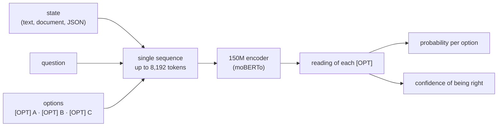

[Leia em português](/posts/dinah-0/){: .lang-link}

This article is an English translation of the original article written in Portuguese, you can find it [here](/posts/dinah-0/).

**150 million parameters, running on my Mac's CPU, against billion-parameter models on the Decision Index.**

If you work in tech, you've surely heard about **Jev** in the last few weeks. It became the hot thing of the moment: you send a state, a question and the options, and it returns the decision with probabilities. Routing support tickets, checking clauses or policies, picking the right department.

But, just between us: classifying, ranking and choosing between options has been the bread and butter of machine learning since long before anyone talked about LLMs. What Jev did was serve that bread and butter **to everyone, about anything**, in a single model, packaged in a cheap and fast API. The credit is theirs, and that's definitely what made it the yardstick for this kind of engine.

Before going on, it's worth going back a few years to give this article some context…

## The forgotten half of the Transformer

In 2017, a Google team introduced the **Transformer** in the paper *Attention Is All You Need* ([Vaswani et al., 2017](https://arxiv.org/abs/1706.03762)), the starting point of everything we now call an LLM. It had **two halves**: an **encoder**, which reads the whole text at once and understands the context, and a **decoder**, which generates text word by word.

In 2018, the halves split up. **Peter J. Liu** and colleagues, at Google itself, showed that a **decoder-only** Transformer could write Wikipedia articles ([Liu et al., 2018](https://arxiv.org/abs/1801.10198)); OpenAI adopted the idea in GPT-1 ([Radford et al., 2018](https://cdn.openai.com/research-covers/language-unsupervised/language_understanding_paper.pdf), which cites Liu's paper), and that path, years later, led to the generative LLMs we use today. A few months later, Google released **BERT** ([Devlin et al., 2018](https://arxiv.org/abs/1810.04805)), **encoder-only**.

Decoders became synonymous with generation, and encoders were somewhat hidden by the hype, but they kept evolving as comprehension machines: they're in search, in spam filters and in the embeddings of most RAG systems. In 2024 came **ModernBERT** ([Warner et al., 2024](https://arxiv.org/abs/2412.13663)), with an 8,192-token context, and Tropic AI adapted ModernBERT to Portuguese and created [**moBERTo**](https://huggingface.co/Tropic-AI/moBERTo-orig-tokenizer). And here's the trick: **deciding is not generating**. To choose between options, you don't need to produce a long answer. You need to represent the context, compare the alternatives and give each one a probability.

That's when I went looking for the community benchmarks and found the [**Decision Index**](https://huggingface.co/spaces/multimodalart/jev-decision-index). What caught my attention right away was that, of the 70 models on the leaderboard (as of 09/28/2026), 59 are decoders, and 45 of them have between 2 and 36 billion parameters. So I had an epiphany, or a slightly dumb idea:

**if the encoder is the specialist in reading and understanding, why is almost everyone betting on decoders to beat Jev? How far can a small encoder go against the billions of parameters of the decoders the community is using?**

## And then came Dinah-0

{: w="360" h="360" }
_Dinah, drawn by my sister, [@shunnk0](https://www.instagram.com/shunnk0/)._

Dinah is my small, affectionate, super needy but extremely smart black cat, and the model is named after her precisely because it's small and very smart at the same time. **Dinah-0** is a **149.6-million-parameter** encoder, built on top of moBERTo, trained to make decisions, **143.7 MB in ONNX int8** and running on the CPU. Each option comes after an `[OPT]` marker, and it reads state, question and options all at once:



Before the numbers, a demo: Dinah against Jev on 200 chess puzzles, each one measured in its own environment.


_Dinah-0, on my Mac's CPU, against Jev, through the remote API, each at its own pace, on 200 chess puzzles drawn from the 2,000-puzzle set: **72.0% vs 57.5%** accuracy, **63 ms vs 343 ms** per decision. Dinah finishes in 12.7 seconds; Jev, in 1 minute 9._

> The video numbers are from the demo only: 200 puzzles drawn from the same 2,000 of the benchmark. The official result, on all 2,000, comes further below. And the 63 ms is the average time per decision on these puzzles, which are short inputs (~220 tokens); the latency table below uses a standardized measurement, with 512 tokens.
{: .prompt-info }

> **Spoiler:** no, Dinah didn't beat Jev on the overall leaderboard. But she did something I didn't expect.

## The little one that got onto the giants' leaderboard

Decision Index 0.2.1 brings together **38 benchmarks across five areas**, with chance-corrected scores (0 is guessing, 100 is perfect) and unanswered questions counting as wrong. I ran the full suite, **150,759 requests**, with the [official kit and scorer](https://github.com/apolinario/decision-index), without picking benchmarks and without dropping bad results (the 324 requests longer than 8,192 tokens were refused and counted as wrong).

| # | Model | Parameters | Decision Index |
| ---: | --- | ---: | ---: |
| 1 | Jev | not disclosed | **57.91** |
| 2 | Surogate Rune 26B-A4B v3 | 26B | 57.44 |
| … | | | |
| 38 | Decider 2B | 2.3B | 28.97 |
| 39 | openvons | 4.0B | 28.42 |
| 40 | this-that 1.2 | 1.9B | 28.14 |
| **41** | **Dinah-0** | **0.15B** | **27.63** |
| 42 | Metask-Jev-4B | 4.7B | 26.89 |
| 43 | SemIf | 4.7B | 25.94 |
| 44 | Decision 1.0 Sol | 2.3B | 25.32 |
| 45 | mini-jev | 4.0B | 20.98 |
| … | | | |
| 48 | JPT-0.8B | 0.87B | 19.22 |
| … | | | |
| 62 | Laya | 0.42B | 6.04 |
| … | | | |
| 72 | LFM2.5-350M-RLCD | 0.35B | 1.38 |
{: .full-width-table }



The most interesting reading is in the middle of the table: Dinah scored **27.63**, against 19.22 for the best previous model under 1B, with a sixth of the parameters, and finished ahead of models with **2 to 4.7 billion**. Among the encoders on this 09/28 snapshot of the leaderboard, no other goes above 12 points.

But the top puts things in perspective: Jev scored **57.91**. The story here is not "a small model beat a big model".

> **The story is that a 150M encoder, running on the CPU, reached 27.63 on a leaderboard dominated by much larger models.**

<small>Positions on the live leaderboard of 09/28 (70 models, plus Jev), with Dinah's score measured with the official kit; the submission is under review. Dinah was trained only on the public training splits of the source datasets and never saw the test questions.</small>

## What she actually learned

### To play chess (after being worse than chance)

The first model got **3.6%** of the puzzles right, against ~9.8% by chance. I trained it again with [Lichess puzzles](https://database.lichess.org/#puzzles) and each move described by what it does (capture, check, quiet move), the same descriptions Jev receives:

```text
state:     5rk1/1Qp4p/6pB/3p4/7P/3q1N2/PPr2bP1/5RK1 w - - 0 24 (white to move, in check)
question:  What is the best move for the side to move?
options:   Kh2: quiet move · Kh1: quiet move · Rxf2: captures bishop
correct:   Rxf2
```

**3.6% → 62.0%**, against 48.3% for Jev on the same 2,000 puzzles. It doesn't mean Dinah "understands chess". It means a model of this size learns a specialized decision function when the data is aligned with the task.

### To decide better than Jev on the tasks it trained on

And it wasn't just chess. On the same items, Dinah beats Jev on the three sets it was trained on, and makes smaller probability errors:

| | Dinah-0 | Jev | Difference |
| --- | ---: | ---: | ---: |
| Typed English (2,000) | **76.4%** | 73.1% | **+3.3 pp** (p = 0.004) |
| Typed Portuguese (1,895) | **78.2%** | 73.2% | **+5.0 pp** (p < 0.001) |
| Chess (2,000) | **62.0%** | 48.3% | **+13.8 pp** (p < 0.001) |
| Brier score ↓ (Brier, 1950) | **0.062** | 0.148 | less than half |



The tests used the same items for both, with a paired bootstrap (Efron and Tibshirani, 1993) of 4,000 resamples. Dinah was fine-tuned on the training splits of these tasks, with separate test sets; so it's not zero-shot: it's specialist against generalist. In the Brier score, the labels are the distributions of a panel of raters, not a single answer.

### To learn fast, as far as the base allows

On tasks that weren't in any of my training, I tested what happens with few examples: **LEDGAR** ([Chalkidis et al., 2022](https://arxiv.org/abs/2110.00976)), 100 types of contract clause, and **News Category** ([Misra, 2022](https://arxiv.org/abs/2209.11429)), 42 HuffPost sections. Protocol registered before running: 2,000 fixed test items, 3 seeds, always the last checkpoint. The opponents: traditional ML (**e5** embeddings, from [Wang et al., 2022](https://arxiv.org/abs/2212.03533), with logistic regression) and Jev zero-shot, with no examples provided by us.

| Examples | LEDGAR, Dinah | LEDGAR, ML | News, Dinah | News, ML |
| ---: | ---: | ---: | ---: | ---: |
| 10 | **0.259** | 0.011 | **0.139** | 0.022 |
| 50 | **0.350** | 0.131 | **0.200** | 0.130 |
| 250 | **0.486** | 0.379 | 0.246 | **0.259** |
| 1,000 | **0.593** | 0.541 | 0.298 | **0.359** |
| Jev (zero-shot) | **0.616** | · | **0.419** | · |





The message fits in three lines:

- **With few examples, Dinah shoots ahead** (with 50, it scores 0.350 against 0.131 on the clauses).
- **With more examples, the advantage shrinks**; on the clauses, with 1,000, it gets close to Jev (0.593 against 0.616).
- **If the base doesn't know the domain, examples don't work miracles**: on the news, which demand world knowledge, traditional ML passes Dinah from 250 on.

The control with **raw moBERTo** (the yellow line in the charts) confirms that the head start comes from the decision training: with 10 examples, Dinah wins by 13 to 21 points. As the examples grow, the difference disappears, and on the news raw moBERTo ends up ahead. **The specialist inherits both the capabilities and the limitations of its base.**

> **Something that worked better than I expected.** I also tested a citation mechanism: Dinah marks the passage that supports the decision. Removing the cited passage changed **24.1%** of the decisions, against **1.5%** when removing a similar random sentence, about **16 times** more (the *comprehensiveness* test from ERASER, [DeYoung et al., 2020](https://arxiv.org/abs/1911.03429)). On ContractNLI ([Koreeda and Manning, 2021](https://arxiv.org/abs/2110.01799)), this prototype reached **0.744**, against 0.717 for Jev. It's one of the experiments I most want to keep exploring.
{: .prompt-tip }

## What almost killed the experiment

My first full run on the Decision Index scored **12.69**.

I thought I had trained a bad model.

So I went benchmark by benchmark, and found that on HellaSwag ([Zellers et al., 2019](https://arxiv.org/abs/1905.07830)) and WinoGrande ([Sakaguchi et al., 2019](https://arxiv.org/abs/1907.10641)) I had trained with the text in `state`, while the Decision Index put the text in `instruction`. On CLINC ([Larson et al., 2019](https://arxiv.org/abs/1909.02027)), Dinah trained seeing 10 intents at a time; the leaderboard showed all 151 at once. The model wasn't necessarily getting the task wrong. **I was teaching the task in the wrong format.**

I fixed the format, added public data for the areas that were at zero (tool selection, causal reasoning, claim verification and arithmetic) and ran it again:

**12.69 → 27.63.** More than double.

> **If you're building a decision model, the format of the decision is part of the task.**

BFCL ([Patil et al., 2025](https://proceedings.mlr.press/v267/patil25a.html)) taught me the humiliating version of the same lesson. Even with ~60 thousand examples, the first version scored **zero**. I had included examples where no tool should be used, and Dinah found the perfect strategy for that dataset: say "don't use it" almost every time. I removed those cases: **0 → 0.47**.

And then there was the engineering part. The ONNX export turned ModernBERT's local attention, where each token looks at 64 neighbors on each side, into a dense masked attention: with 8k tokens, that took **24 seconds** on the CPU. I rewrote the operation to process the windows in blocks of 64, with the same weights and the same answers: **24 s → 6.5 s**.

<details markdown="1">
<summary>See the block-wise local attention code</summary>

```python
def _local(q, k, v, key_ok, window: int, scale: float):
    """q, k, v: (b, h, L, d). Each query i sees the keys j with |i - j| <= window."""
    b, h, L, d = q.shape
    B = 64
    qb = q.reshape(b, h, -1, B, d)
    # keys of each block: neighboring blocks [n-1, n, n+1]
    kp = F.pad(k, (0, 0, B, B)).reshape(b, h, -1, B, d)
    kb = torch.cat([kp[:, :, :-2], kp[:, :, 1:-1], kp[:, :, 2:]], dim=3)
    # ... the same for v, the band mask and the softmax
```

</details>

| Context | CPU latency (Mac M5, 4 threads, batch 1) |
| ---: | ---: |
| 512 tokens | **131 ms** |
| 2,048 tokens | **0.70 s** |
| 8,192 tokens | **6.5 s** (before: 24 s) |

Memory was still a problem: ~750 MB with 512 tokens and over 6 GB at peak with 8k, because of the global attention layers. For comparison: the network round trip to Jev alone was ~330 ms.

## Seven days, 1.19 billion tokens and less than US$ 15

| Behind the scenes | |
| --- | ---: |
| days | 7 (September 22 to 28) |
| main training runs | ~45 |
| short runs on the few-shot curves | ~150 |
| Decision Index requests | ~452 thousand (3 full runs) |
| training examples processed | ~4.6 million |
| **training tokens** | **~1.19 billion** (Mac ~330M · Colab ~380M · vast.ai ~470M) |
| machines | Mac M5 + 92 L4 VMs on Colab + 23 GPUs rented on vast.ai (14 RTX 3090, 8 RTX 5090, 1 RTX 4000 Ada), in 5 countries |
| datasets | 27 (3.6 GB) |
| code | ~12,400 lines of Python, ~1,500 of shell, ~1,500 of Rust |
| cost | Colab ~US$ 7 · vast.ai ~US$ 4.90 · Jev API (for measuring only) ~US$ 2.30 |
| **total** | **less than US$ 15** |

The last training run had 605 thousand examples and 163 million tokens, in 2h30 on an RTX 5090 rented at US$ 0.47/h: less than one cent per million tokens.

Not everything was pretty. One night, the Colab VMs died at 01:25 and I only noticed at 06:36. Another day, a rented machine was destroyed before I downloaded the weights of the model it had just trained. Today nothing is destroyed until the checkpoint gets home with its size checked.

And the perspective I like the most: the base had already read ~2 trillion tokens (ModernBERT) and ~70 billion in Portuguese (moBERTo). My training is less than **0.06%** of that.

**I didn't teach Dinah about the world. I taught her to decide.**

## What I learned

The 150M still break where you'd expect: Dinah stays close to chance on world knowledge, like **MMLU-Pro** ([Wang et al., 2024](https://arxiv.org/abs/2406.01574)) and **GPQA** ([Rein et al., 2023](https://arxiv.org/abs/2311.12022)), and on multi-step reasoning, like **NLI4CT** ([Jullien et al., 2023](https://arxiv.org/abs/2305.02993)). Decision training doesn't replace knowledge that isn't in the representation.

## So, did she beat Jev?

On the overall leaderboard, no. **Jev: 57.91. Dinah: 27.63.**

But the 150M little one beat Jev on the three decision sets she was trained for and finished ahead of 2-to-4.7-billion-parameter models on the Decision Index. That's what I wanted to find out when I started: **how far can a small encoder go when we teach it exactly what it needs to do?**

The model is already open on Hugging Face, at [**Lukitaduarte/dinah-0**](https://huggingface.co/Lukitaduarte/dinah-0), and I want to open the experiments too, so anyone can reproduce every number in this post. And maybe, instead of asking **"what's the biggest model we can put here?"**, it's worth asking **"what's the smallest model that learned exactly what we need?"**

I don't know how far this idea can go. It was seven days, 1.19 billion tokens, dozens of GPUs, less than US$ 15 and a 150-million-parameter black cat. And, for a week, she was great company for finding out how far a small model can go.

If you want to test it, break it or discuss it, leave a comment.

---

## References

- Vaswani et al. (2017). *Attention Is All You Need*. [arXiv:1706.03762](https://arxiv.org/abs/1706.03762)
- Liu et al. (2018). *Generating Wikipedia by Summarizing Long Sequences* (the first decoder-only Transformer). [arXiv:1801.10198](https://arxiv.org/abs/1801.10198)
- Radford et al. (2018). *Improving Language Understanding by Generative Pre-Training* (GPT-1). [OpenAI](https://cdn.openai.com/research-covers/language-unsupervised/language_understanding_paper.pdf)
- Devlin et al. (2018). *BERT: Pre-training of Deep Bidirectional Transformers for Language Understanding*. [arXiv:1810.04805](https://arxiv.org/abs/1810.04805)
- Warner et al. (2024). *Smarter, Better, Faster, Longer: A Modern Bidirectional Encoder* (ModernBERT). [arXiv:2412.13663](https://arxiv.org/abs/2412.13663)
- Tropic AI. *moBERTo*, ModernBERT pre-trained in Portuguese. [Hugging Face](https://huggingface.co/Tropic-AI/moBERTo-orig-tokenizer)
- *Decision Index 0.2.1*: [live leaderboard](https://huggingface.co/spaces/multimodalart/jev-decision-index) and [reproduction kit](https://github.com/apolinario/decision-index).
- Chalkidis et al. (2022). *LexGLUE: A Benchmark Dataset for Legal Language Understanding in English* (LEDGAR). [arXiv:2110.00976](https://arxiv.org/abs/2110.00976)
- Misra (2022). *News Category Dataset*. [arXiv:2209.11429](https://arxiv.org/abs/2209.11429)
- Wang et al. (2022). *Text Embeddings by Weakly-Supervised Contrastive Pre-training* (e5). [arXiv:2212.03533](https://arxiv.org/abs/2212.03533)
- Zellers et al. (2019). *HellaSwag: Can a Machine Really Finish Your Sentence?* [arXiv:1905.07830](https://arxiv.org/abs/1905.07830)
- Sakaguchi et al. (2019). *WinoGrande: An Adversarial Winograd Schema Challenge at Scale*. [arXiv:1907.10641](https://arxiv.org/abs/1907.10641)
- Larson et al. (2019). *An Evaluation Dataset for Intent Classification and Out-of-Scope Prediction* (CLINC150). [arXiv:1909.02027](https://arxiv.org/abs/1909.02027)
- Patil et al. (2025). *The Berkeley Function Calling Leaderboard (BFCL): From Tool Use to Agentic Evaluation of Large Language Models*. [ICML 2025](https://proceedings.mlr.press/v267/patil25a.html)
- Wang et al. (2024). *MMLU-Pro: A More Robust and Challenging Multi-Task Language Understanding Benchmark*. [arXiv:2406.01574](https://arxiv.org/abs/2406.01574)
- Rein et al. (2023). *GPQA: A Graduate-Level Google-Proof Q&A Benchmark*. [arXiv:2311.12022](https://arxiv.org/abs/2311.12022)
- Jullien et al. (2023). *SemEval-2023 Task 7: Multi-Evidence Natural Language Inference for Clinical Trial Data* (NLI4CT). [arXiv:2305.02993](https://arxiv.org/abs/2305.02993)
- Koreeda and Manning (2021). *ContractNLI: A Dataset for Document-level Natural Language Inference for Contracts*. [arXiv:2110.01799](https://arxiv.org/abs/2110.01799)
- DeYoung et al. (2020). *ERASER: A Benchmark to Evaluate Rationalized NLP Models*. [arXiv:1911.03429](https://arxiv.org/abs/1911.03429)
- Lichess. *Puzzle database* (CC0). [database.lichess.org](https://database.lichess.org/#puzzles)
- Brier (1950). *Verification of Forecasts Expressed in Terms of Probability*. Monthly Weather Review, 78(1).
- Efron and Tibshirani (1993). *An Introduction to the Bootstrap*. Chapman & Hall.


