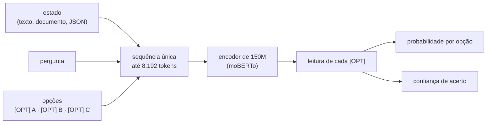

[Read in English](/posts/dinah-0-en/){: .lang-link}

**150 milhões de parâmetros, rodando no CPU do meu Mac, contra modelos de bilhões de parâmetros no Decision Index.**

Se você trabalha com tecnologia, com certeza já ouviu falar no **Jev** nas últimas semanas. Ele virou a sensação do momento: você manda um estado, uma pergunta e as opções, e ele devolve a decisão com probabilidades. Classificar chamados, validar cláusulas ou políticas, escolher o departamento certo.

Mas, cá entre nós: classificar, ranquear e decidir entre opções é o feijão com arroz do machine learning desde muito antes de alguém falar em LLM. O que o Jev fez foi servir esse feijão com arroz **para todo mundo, sobre qualquer assunto**, num modelo só, e empacotado em uma API barata e rápida. O mérito é dele, e definitivamente é o que o fez virar a régua desse tipo de motor.

Antes de continuar, vale voltar alguns anos para contextualizar melhor este artigo…

## A metade esquecida do Transformer

Em 2017, um time do Google apresentou o **Transformer** no artigo *Attention Is All You Need* ([Vaswani et al., 2017](https://arxiv.org/abs/1706.03762)), o pontapé inicial de tudo o que chamamos de LLM. Ele tinha **duas metades**: um **encoder**, que lê o texto inteiro de uma vez e entende o contexto, e um **decoder**, que gera texto palavra por palavra.

Em 2018, as metades se separaram. **Peter J. Liu** e colegas, no próprio Google, mostraram que um Transformer **só com o decoder** conseguia escrever artigos da Wikipédia ([Liu et al., 2018](https://arxiv.org/abs/1801.10198)); a OpenAI adotou a ideia no GPT-1 ([Radford et al., 2018](https://cdn.openai.com/research-covers/language-unsupervised/language_understanding_paper.pdf), que cita o de Liu), e esse caminho, anos depois, levou aos LLMs generativos que usamos hoje. Meses depois, o Google lançou o **BERT** ([Devlin et al., 2018](https://arxiv.org/abs/1810.04805)), só com o **encoder**.

Os decoders viraram sinônimo de geração, e os encoders ficaram meio escondidos pelo hype, mas seguiram evoluindo como máquinas de compreensão: estão na busca, nos filtros de spam e nos embeddings de boa parte dos sistemas RAG. Em 2024 veio o **ModernBERT** ([Warner et al., 2024](https://arxiv.org/abs/2412.13663)), com contexto de 8.192 tokens, e a Tropic AI adaptou o ModernBERT para português e criou o [**moBERTo**](https://huggingface.co/Tropic-AI/moBERTo-orig-tokenizer). E aqui está o pulo do gato: **decidir não é gerar**. Para escolher entre opções, você não precisa produzir uma resposta longa. Precisa representar o contexto, comparar as alternativas e dar uma probabilidade a cada uma.

Foi aí que fui pesquisar os benchmarks da comunidade e encontrei o [**Decision Index**](https://huggingface.co/spaces/multimodalart/jev-decision-index). O que me chamou atenção logo de cara foi que dos 70 modelos medidos pelo placar (em 28/09/2026), 59 são decoders, e 45 deles têm de 2 a 36 bilhões de parâmetros. Então eu tive uma epifania, ou uma ideia meio idiota:

**se o encoder é o especialista na leitura e entendimento, por que quase todo mundo está apostando no decoder para bater o Jev? Qual o limite de um encoder pequeno diante dos bilhões de parâmetros dos decoders utilizados pela comunidade?**

## Eis que surge a Dinah-0

{: w="360" h="360" }
_A Dinah, desenhada pela minha irmã, [@shunnk0](https://www.instagram.com/shunnk0/)._

Dinah é a minha pequena, carinhosa, super carente mas extremamente inteligente gatinha preta, e o modelo leva o nome dela justamente por ser pequena e muito inteligente ao mesmo tempo. A **Dinah-0** é um encoder de **149,6 milhões de parâmetros**, construído sobre o moBERTo, treinado para tomar decisões, com **143,7 MB em ONNX int8** e rodando no CPU. Cada opção entra depois de um marcador `[OPT]`, e ela lê estado, pergunta e opções de uma vez só:



Antes dos números, uma demonstração: a Dinah contra o Jev em 200 puzzles de xadrez, cada um medido no seu ambiente.


_Dinah-0, no CPU do meu Mac, contra o Jev, pela API remota, cada um no seu ritmo, em 200 puzzles de xadrez sorteados do conjunto de 2.000: **72,0% contra 57,5%** de acerto, **63 ms contra 343 ms** por decisão. A Dinah termina em 12,7 segundos; o Jev, em 1 minuto e 9._

> Os números do vídeo são só da demonstração: 200 puzzles sorteados dos mesmos 2.000 do benchmark. O resultado oficial, nos 2.000, vem mais abaixo. E os 63 ms são o tempo médio por decisão nesses puzzles, que são entradas curtas (~220 tokens); a tabela de latência mais abaixo usa uma medição padronizada, com 512 tokens.
{: .prompt-info }

> **Spoiler:** não, a Dinah não ganhou do Jev no placar geral. Mas ela fez algo que eu não esperava.

## A pequena que entrou no placar dos gigantes

O Decision Index 0.2.1 reúne **38 benchmarks em cinco áreas**, com nota corrigida pelo acaso (0 é chutar, 100 é perfeito) e pergunta sem resposta contando como erro. Rodei a suíte completa, **150.759 requests**, com o [kit e o scorer oficiais](https://github.com/apolinario/decision-index), sem escolher benchmark e sem cortar resultado ruim (os 324 pedidos maiores que 8.192 tokens foram recusados e contaram como erro).

| # | Modelo | Parâmetros | Decision Index |
| ---: | --- | ---: | ---: |
| 1 | Jev | não divulgado | **57,91** |
| 2 | Surogate Rune 26B-A4B v3 | 26B | 57,44 |
| … | | | |
| 38 | Decider 2B | 2,3B | 28,97 |
| 39 | openvons | 4,0B | 28,42 |
| 40 | this-that 1.2 | 1,9B | 28,14 |
| **41** | **Dinah-0** | **0,15B** | **27,63** |
| 42 | Metask-Jev-4B | 4,7B | 26,89 |
| 43 | SemIf | 4,7B | 25,94 |
| 44 | Decision 1.0 Sol | 2,3B | 25,32 |
| 45 | mini-jev | 4,0B | 20,98 |
| … | | | |
| 48 | JPT-0.8B | 0,87B | 19,22 |
| … | | | |
| 62 | Laya | 0,42B | 6,04 |
| … | | | |
| 72 | LFM2.5-350M-RLCD | 0,35B | 1,38 |
{: .full-width-table }



A leitura mais interessante está no meio da tabela: a Dinah fez **27,63**, contra 19,22 do melhor modelo anterior abaixo de 1B, com um sexto dos parâmetros, e ficou à frente de modelos de **2 a 4,7 bilhões**. Entre os encoders presentes nesse placar no snapshot de 28/09, nenhum outro passa de 12 pontos.

Mas o topo coloca as coisas em perspectiva: o Jev fez **57,91**. A história aqui não é "um modelo pequeno derrotou um modelo grande".

> **A história é que um encoder de 150M, que roda no CPU, chegou a 27,63 num placar dominado por modelos muito maiores.**

<small>Posições no placar ao vivo de 28/09 (70 modelos, mais o Jev), com a nota da Dinah medida pelo kit oficial; a submissão está em revisão. A Dinah treinou só nos splits públicos de treino das bases de origem e nunca viu as perguntas do teste.</small>

## O que ela realmente aprendeu

### A jogar xadrez (depois de ser pior que o acaso)

O primeiro modelo acertava **3,6%** dos puzzles, contra ~9,8% do acaso. Treinei de novo com [puzzles do Lichess](https://database.lichess.org/#puzzles) e cada lance descrito pelo que faz (captura, xeque, lance comum), as mesmas descrições que o Jev recebe:

```text
estado:    5rk1/1Qp4p/6pB/3p4/7P/3q1N2/PPr2bP1/5RK1 w - - 0 24 (vez das brancas, em xeque)
pergunta:  Qual é o melhor lance para o lado que joga?
opções:    Kh2: lance comum · Kh1: lance comum · Rxf2: captura bispo
certo:     Rxf2
```

**3,6% → 62,0%**, contra 48,3% do Jev nos mesmos 2.000 puzzles. Não significa que a Dinah "entende xadrez". Significa que um modelo desse tamanho aprende uma função de decisão especializada quando os dados estão alinhados com a tarefa.

### A decidir melhor que o Jev nas tarefas que treinou

E não foi só xadrez. Nos mesmos itens, a Dinah passa o Jev nos três conjuntos em que foi treinada, e erra menos nas probabilidades:

| | Dinah-0 | Jev | Diferença |
| --- | ---: | ---: | ---: |
| Typed English (2.000) | **76,4%** | 73,1% | **+3,3 pp** (p = 0,004) |
| Typed Portuguese (1.895) | **78,2%** | 73,2% | **+5,0 pp** (p < 0,001) |
| Chess (2.000) | **62,0%** | 48,3% | **+13,8 pp** (p < 0,001) |
| Brier score ↓ (Brier, 1950) | **0,062** | 0,148 | menos da metade |



Os testes usaram os mesmos itens para os dois, com bootstrap pareado (Efron e Tibshirani, 1993) de 4.000 reamostragens. A Dinah fez fine-tuning nos splits de treino dessas tarefas, com os testes separados; então não é zero-shot: é especialista contra generalista. No Brier, os rótulos são as distribuições de um painel de avaliadores, não uma resposta única.

### A aprender rápido, até onde a base deixa

Em tarefas que não estavam em nenhum treino meu, testei o que acontece com poucos exemplos: o **LEDGAR** ([Chalkidis et al., 2022](https://arxiv.org/abs/2110.00976)), 100 tipos de cláusula de contrato, e o **News Category** ([Misra, 2022](https://arxiv.org/abs/2209.11429)), 42 seções do HuffPost. Protocolo registrado antes de rodar: 2.000 itens de teste fixos, 3 seeds, sempre o último checkpoint. Os adversários: ML tradicional (embeddings **e5**, de [Wang et al., 2022](https://arxiv.org/abs/2212.03533), com regressão logística) e o Jev em zero-shot, sem exemplos fornecidos por nós.

| Exemplos | LEDGAR, Dinah | LEDGAR, ML | News, Dinah | News, ML |
| ---: | ---: | ---: | ---: | ---: |
| 10 | **0,259** | 0,011 | **0,139** | 0,022 |
| 50 | **0,350** | 0,131 | **0,200** | 0,130 |
| 250 | **0,486** | 0,379 | 0,246 | **0,259** |
| 1.000 | **0,593** | 0,541 | 0,298 | **0,359** |
| Jev (zero-shot) | **0,616** | · | **0,419** | · |





A mensagem cabe em três linhas:

- **Poucos exemplos, a Dinah dispara na frente** (com 50, faz 0,350 contra 0,131 nas cláusulas).
- **Com mais exemplos, a vantagem diminui**; nas cláusulas, com 1.000, ela chega perto do Jev (0,593 contra 0,616).
- **Se a base não conhece o domínio, exemplos não fazem milagre**: nas notícias, que pedem conhecimento de mundo, o ML tradicional passa a Dinah a partir de 250.

O controle com o **moBERTo cru** (a linha amarela nos gráficos) confirma que a largada vem do treino de decisão: com 10 exemplos, a Dinah ganha de 13 a 21 pontos. Conforme os exemplos aumentam, a diferença some, e nas notícias o moBERTo cru acaba passando à frente. **O especialista herda as capacidades e as limitações da base.**

> **Uma coisa que funcionou melhor do que eu esperava.** Também testei um mecanismo de citação: a Dinah marca o trecho que sustenta a decisão. Remover o trecho citado mudou **24,1%** das decisões, contra **1,5%** ao remover uma sentença aleatória parecida, cerca de **16 vezes** mais (o teste de *comprehensiveness* do ERASER, [DeYoung et al., 2020](https://arxiv.org/abs/1911.03429)). No ContractNLI ([Koreeda e Manning, 2021](https://arxiv.org/abs/2110.01799)), esse protótipo chegou a **0,744**, contra 0,717 do Jev. Esse é um dos experimentos que eu mais quero continuar explorando.
{: .prompt-tip }

## O que quase matou o experimento

Minha primeira execução completa no Decision Index deu **12,69**.

Eu achei que tinha treinado um modelo ruim.

Então fui benchmark por benchmark, e descobri que em HellaSwag ([Zellers et al., 2019](https://arxiv.org/abs/1905.07830)) e WinoGrande ([Sakaguchi et al., 2019](https://arxiv.org/abs/1907.10641)) eu tinha treinado com o texto em `state`, enquanto o Decision Index colocava o texto em `instruction`. No CLINC ([Larson et al., 2019](https://arxiv.org/abs/1909.02027)), a Dinah treinou vendo 10 intenções por vez; o placar mostrava as 151 de uma vez. O modelo não estava necessariamente errando a tarefa. **Eu estava ensinando a tarefa no formato errado.**

Corrigi o formato, adicionei dados públicos para as áreas que estavam zeradas (seleção de ferramentas, raciocínio causal, verificação de afirmações e aritmética) e rodei de novo:

**12,69 → 27,63.** Mais que o dobro.

> **Se você está construindo um modelo de decisão, o formato da decisão faz parte da tarefa.**

O BFCL ([Patil et al., 2025](https://proceedings.mlr.press/v267/patil25a.html)) me deu a versão humilhante da mesma lição. Mesmo com ~60 mil exemplos, a primeira versão marcou **zero**. Eu tinha incluído exemplos em que nenhuma ferramenta deveria ser usada, e a Dinah achou a estratégia perfeita para aquele dataset: dizer "não use" quase sempre. Tirei esses casos: **0 → 0,47**.

E teve a parte de engenharia. A exportação para ONNX transformou a atenção local do ModernBERT, em que cada token olha 64 vizinhos de cada lado, numa atenção densa mascarada: com 8k tokens, isso levava **24 segundos** no CPU. Reescrevi a operação para processar as janelas em blocos de 64, com os mesmos pesos e as mesmas respostas: **24 s → 6,5 s**.

<details markdown="1">
<summary>Ver o código da atenção local em blocos</summary>

```python
def _local(q, k, v, chave_ok, janela: int, escala: float):
    """q, k, v: (b, h, L, d). Cada query i vê as chaves j com |i - j| <= janela."""
    b, h, L, d = q.shape
    B = 64
    qb = q.reshape(b, h, -1, B, d)
    # chaves de cada bloco: blocos vizinhos [n-1, n, n+1]
    kp = F.pad(k, (0, 0, B, B)).reshape(b, h, -1, B, d)
    kb = torch.cat([kp[:, :, :-2], kp[:, :, 1:-1], kp[:, :, 2:]], dim=3)
    # ... a mesma conta para v, a máscara de banda e o softmax
```

</details>

| Contexto | Latência no CPU (Mac M5, 4 threads, batch 1) |
| ---: | ---: |
| 512 tokens | **131 ms** |
| 2.048 tokens | **0,70 s** |
| 8.192 tokens | **6,5 s** (antes: 24 s) |

A memória continuou sendo um problema: ~750 MB com 512 tokens e mais de 6 GB no pico com 8k, por causa das camadas de atenção global. Para comparar: só a ida e volta de rede até o Jev ficou em ~330 ms.

## Sete dias, 1,19 bilhão de tokens e menos de US$ 15

| Os bastidores | |
| --- | ---: |
| dias | 7 (22 a 28 de setembro) |
| treinamentos principais | ~45 |
| ajustes curtos nas curvas few-shot | ~150 |
| requests no Decision Index | ~452 mil (3 execuções completas) |
| exemplos de treino processados | ~4,6 milhões |
| **tokens de treino** | **~1,19 bilhão** (Mac ~330M · Colab ~380M · vast.ai ~470M) |
| máquinas | Mac M5 + 92 VMs L4 no Colab + 23 GPUs alugadas no vast.ai (14 RTX 3090, 8 RTX 5090, 1 RTX 4000 Ada), em 5 países |
| datasets | 27 (3,6 GB) |
| código | ~12.400 linhas de Python, ~1.500 de shell, ~1.500 de Rust |
| custo | Colab ~US$ 7 · vast.ai ~US$ 4,90 · API do Jev (só para medir) ~US$ 2,30 |
| **total** | **menos de US$ 15** |

O último treino teve 605 mil exemplos e 163 milhões de tokens, em 2h30 numa RTX 5090 alugada a US$ 0,47/h: menos de um centavo por milhão de tokens.

Nem tudo foi bonito. Numa madrugada, as VMs do Colab morreram às 01:25 e eu só percebi às 06:36. Noutro dia, uma máquina alugada foi destruída antes de eu baixar os pesos do modelo que ela tinha acabado de treinar. Hoje nada é destruído antes de o checkpoint chegar em casa com o tamanho conferido.

E a perspectiva que eu mais gosto: a base já tinha lido ~2 trilhões de tokens (ModernBERT) e ~70 bilhões em português (moBERTo). O meu treino é menos de **0,06%** disso.

**Eu não ensinei o mundo para a Dinah. Ensinei ela a decidir.**

## O que eu aprendi

Os 150M ainda quebram onde era de se esperar: a Dinah fica perto do acaso em conhecimento de mundo, como **MMLU-Pro** ([Wang et al., 2024](https://arxiv.org/abs/2406.01574)) e **GPQA** ([Rein et al., 2023](https://arxiv.org/abs/2311.12022)), e em raciocínio de várias etapas, como o **NLI4CT** ([Jullien et al., 2023](https://arxiv.org/abs/2305.02993)). Treino de decisão não substitui o conhecimento que não está na representação.

## Então, ela derrotou o Jev?

No placar geral, não. **Jev: 57,91. Dinah: 27,63.**

Mas a pequena de 150M passou o Jev nos três conjuntos de decisões para os quais foi treinada e terminou à frente de modelos de 2 a 4,7 bilhões de parâmetros no Decision Index. Era isso que eu queria descobrir quando comecei: **até onde um encoder pequeno consegue chegar quando ensinamos exatamente o que ele precisa fazer?**

O modelo já está aberto no Hugging Face, em [**Lukitaduarte/dinah-0**](https://huggingface.co/Lukitaduarte/dinah-0), e quero abrir também os experimentos para qualquer pessoa reproduzir cada número deste post. E talvez, em vez de perguntar **"qual é o maior modelo que podemos colocar aqui?"**, valha perguntar **"qual é o menor modelo que aprendeu exatamente o que precisamos?"**

Não sei até onde dá para levar essa ideia. Foram sete dias, 1,19 bilhão de tokens, dezenas de GPUs, menos de US$ 15 e uma gata preta de 150 milhões de parâmetros. E, por uma semana, ela foi uma ótima companhia para descobrir até onde um modelo pequeno consegue chegar.

Se quiser testar, quebrar ou discutir, comenta aqui.

---

## Referências

- Vaswani et al. (2017). *Attention Is All You Need*. [arXiv:1706.03762](https://arxiv.org/abs/1706.03762)
- Liu et al. (2018). *Generating Wikipedia by Summarizing Long Sequences* (o primeiro Transformer só com decoder). [arXiv:1801.10198](https://arxiv.org/abs/1801.10198)
- Radford et al. (2018). *Improving Language Understanding by Generative Pre-Training* (GPT-1). [OpenAI](https://cdn.openai.com/research-covers/language-unsupervised/language_understanding_paper.pdf)
- Devlin et al. (2018). *BERT: Pre-training of Deep Bidirectional Transformers for Language Understanding*. [arXiv:1810.04805](https://arxiv.org/abs/1810.04805)
- Warner et al. (2024). *Smarter, Better, Faster, Longer: A Modern Bidirectional Encoder* (ModernBERT). [arXiv:2412.13663](https://arxiv.org/abs/2412.13663)
- Tropic AI. *moBERTo*, ModernBERT pré-treinado em português. [Hugging Face](https://huggingface.co/Tropic-AI/moBERTo-orig-tokenizer)
- *Decision Index 0.2.1*: [placar ao vivo](https://huggingface.co/spaces/multimodalart/jev-decision-index) e [kit de reprodução](https://github.com/apolinario/decision-index).
- Chalkidis et al. (2022). *LexGLUE: A Benchmark Dataset for Legal Language Understanding in English* (LEDGAR). [arXiv:2110.00976](https://arxiv.org/abs/2110.00976)
- Misra (2022). *News Category Dataset*. [arXiv:2209.11429](https://arxiv.org/abs/2209.11429)
- Wang et al. (2022). *Text Embeddings by Weakly-Supervised Contrastive Pre-training* (e5). [arXiv:2212.03533](https://arxiv.org/abs/2212.03533)
- Zellers et al. (2019). *HellaSwag: Can a Machine Really Finish Your Sentence?* [arXiv:1905.07830](https://arxiv.org/abs/1905.07830)
- Sakaguchi et al. (2019). *WinoGrande: An Adversarial Winograd Schema Challenge at Scale*. [arXiv:1907.10641](https://arxiv.org/abs/1907.10641)
- Larson et al. (2019). *An Evaluation Dataset for Intent Classification and Out-of-Scope Prediction* (CLINC150). [arXiv:1909.02027](https://arxiv.org/abs/1909.02027)
- Patil et al. (2025). *The Berkeley Function Calling Leaderboard (BFCL): From Tool Use to Agentic Evaluation of Large Language Models*. [ICML 2025](https://proceedings.mlr.press/v267/patil25a.html)
- Wang et al. (2024). *MMLU-Pro: A More Robust and Challenging Multi-Task Language Understanding Benchmark*. [arXiv:2406.01574](https://arxiv.org/abs/2406.01574)
- Rein et al. (2023). *GPQA: A Graduate-Level Google-Proof Q&A Benchmark*. [arXiv:2311.12022](https://arxiv.org/abs/2311.12022)
- Jullien et al. (2023). *SemEval-2023 Task 7: Multi-Evidence Natural Language Inference for Clinical Trial Data* (NLI4CT). [arXiv:2305.02993](https://arxiv.org/abs/2305.02993)
- Koreeda e Manning (2021). *ContractNLI: A Dataset for Document-level Natural Language Inference for Contracts*. [arXiv:2110.01799](https://arxiv.org/abs/2110.01799)
- DeYoung et al. (2020). *ERASER: A Benchmark to Evaluate Rationalized NLP Models*. [arXiv:1911.03429](https://arxiv.org/abs/1911.03429)
- Lichess. *Puzzle database* (CC0). [database.lichess.org](https://database.lichess.org/#puzzles)
- Brier (1950). *Verification of Forecasts Expressed in Terms of Probability*. Monthly Weather Review, 78(1).
- Efron e Tibshirani (1993). *An Introduction to the Bootstrap*. Chapman & Hall.
